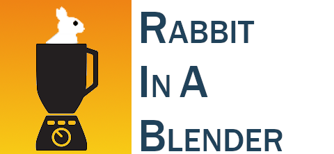

# 


**Rabbit in a Blender (RiaB)** is an [ETL](https://en.wikipedia.org/wiki/Extract,_transform,_load) pipeline [CLI](https://nl.wikipedia.org/wiki/Command-line-interface) to transform your [EMR](https://en.wikipedia.org/wiki/Electronic_health_record) data to [OMOP](https://www.ohdsi.org/data-standardization/the-common-data-model/).

Why the name 'Rabbit in a Blender'? It stays in the rabbit theme of the [OHDSI](https://www.ohdsi.org) tools, and an ETL pipeline is like putting all your data in a blender. 

No rabbits were harmed during the development of this tool!

# Introduction

Extract-Transform-Load (ETL) processes are very complex and are mainly crafted by highly skilled data engineers. The process of transforming the electronic medical record (EMR) data into the observational medical outcomes partnership (OMOP) common data model (CDM) is no exception. The mapping process of the source values to standard concepts is mostly done by subject matter experts, who lack the knowledge of programming the ETL process. Wouldn’t it be nice if we could drastically simplify the ETL process, so that you don’t need seasoned data engineers to start the OMOP CDM journey. Imagine that you just save your queries, Usagi comma separated value (CSV) text files and custom concept CSV’s on disk, and run a command line interface (CLI) tool that does all the ETL magic automatically. 

Currently, our ETL process is supported by **BigQuery** and **SQL Server** (both on-premise and in Azure). We're open to exploring additional database technologies to serve as backends for our ETL process.

# Concept

The main strength of the CDM is its simplified scheme. This scheme is a relational data model, where each table has a primary key and can have foreign keys to other tables. Because of the relational data model, we can extract the dependencies of the tables from the scheme. For example, the provider table is dependent on the care_site table, which is in its turn dependent on the location table. If we flatten that dependency graph, we have a sequence of ETL steps that we need to follow to have consistent data in our OMOP CDM. 

These ETL steps can be automated, so a hospital can focus its resources on the queries and the mapping of the concepts. The automated ETL consists of multiple tasks. It needs to execute queries, add custom concepts, apply the Usagi source to concept mapping, and do a lot of housekeeping. An example of that housekeeping is the autonumbering of the OMOP CDM primary keys, for which the ETL process needs to maintain a swap table that holds the key of the source table and the generated sequential number of the CDM table’s primary key. Another example of the housekeeping is the upload and processing of the Usagi CSV’s and also the upload and parsing of the custom concept CSV’s. 

In an ETL process data is divided in zones (cfr. the [zones in a data lake](https://www.oreilly.com/library/view/the-enterprise-big/9781491931547/ch01.html#zones_of_a_typical_data_lake)). The raw zone holds the source data (for example the data from the EMR), the work zone holds all the house keeping tables of the ETL process and the gold zone holds our final OMOP CDM.

After designing the architecture, the implementation needs to be developed. We have two options to choose from: configuration and convention as design paradigm. We choose convention over configuration, because it decreases the number of decisions the user has to make and eliminates the complexity. As convention a specific folder structure is adopted (see [our mappings as example](https://github.com/RADar-AZDelta/AZDelta-OMOP-CDM)). A folder is created for each OMOP CDM table, where the SQL queries are stored to fill up the specific CDM table. In the table folders we also have for each concept column a sub folder. Those concept column sub folders hold our Usagi CSV’s (files ending with _usagi.csv). We also have a custom folder in the concept column sub folder, that holds the custom concept CSV’s (files ending with _concept.csv). With this convention in place, our ETL CLI tool has everything it needs to do its magic.

&nbsp;


One final requirement we want to build in the ETL CLI tool, is that each ETL step is an atomic operation, it either fails or succeeds, so that there is no possibility to corrupt the final OMOP CDM data.

# ETL flow

The ETL flow is like a **two-stage rocket**. You have a first stage and a second stage in the ETL process. 


**First stage:**

Most CDM tables have foreign keys (FKs) to other tables. Some tables can be processed in parallel by the ETL engine, because they have no FKs dependencies between them, others have to be processed in a specific order.

The ETL flow for v5.4 is as follows:

```
└──vocabulary
  ├──cdm_source
  ├──metadata
  ├──cost
  ├──fact_relationship
  └──location
    └──care_site
      └──provider
        └──person
          ├──condition_era
          ├──death
          ├──dose_era
          ├──drug_era
          ├──episode
          ├──observation_period
          ├──payer_plan_period
          ├──specimen
          └──visit_occurrence
            ├──episode_event
            └──visit_detail
              ├──condition_occurrence
              ├──device_exposure
              ├──drug_exposure
              ├──measurement
              ├──note
              ├──observation
              └──procedure_occurrence
                └──note_nlp
```

**Second stage:** will process all the event foreign key columns (e.g. observation_event_id, cost_event_id, measurement_event_id, etc.). Because those columns can point to almost any table, and the auto generated _id's of those table, are only available after the first stage.

> **RiaB also performs like a rocket** especially in combination with BigQuery. A full ETL resulting in 8 billion CDM records takes about 20 min.

# Getting started

see [getting started](docs/getting_started.md)

# CLI Usage

see [CLI commands](docs/cli.md)

# Authors

* [Lammertyn Pieter-Jan](https://github.com/pjlammertyn)
* [De Jaeger Peter](https://github.com/peterdejaeger)

# License

Copyright © 2024, [RADar-AZDelta](mailto:radar@azdelta.be).
Released under the [GNU General Public License v3.0](LICENSE).

***
